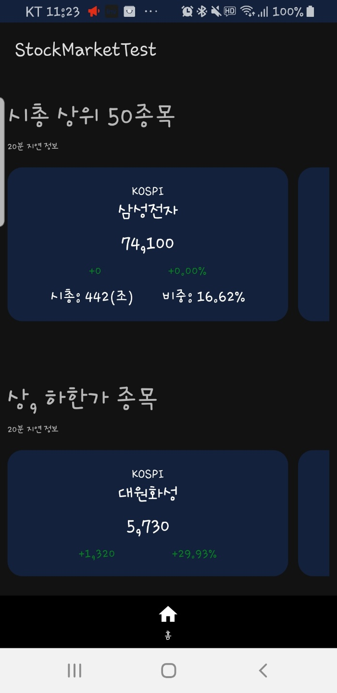
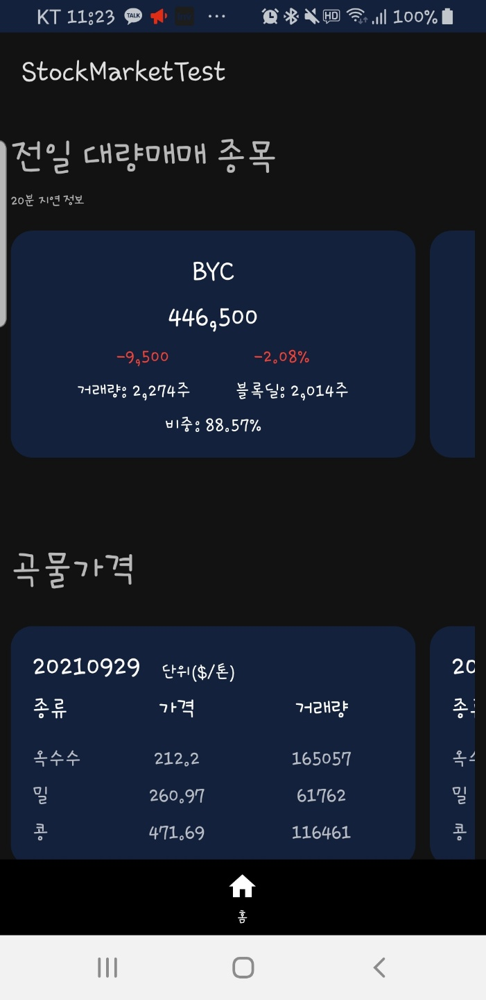
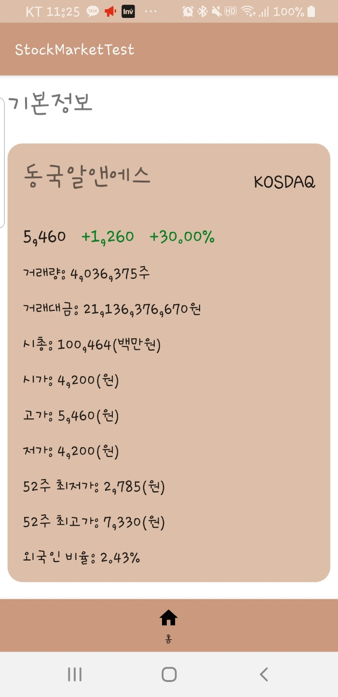
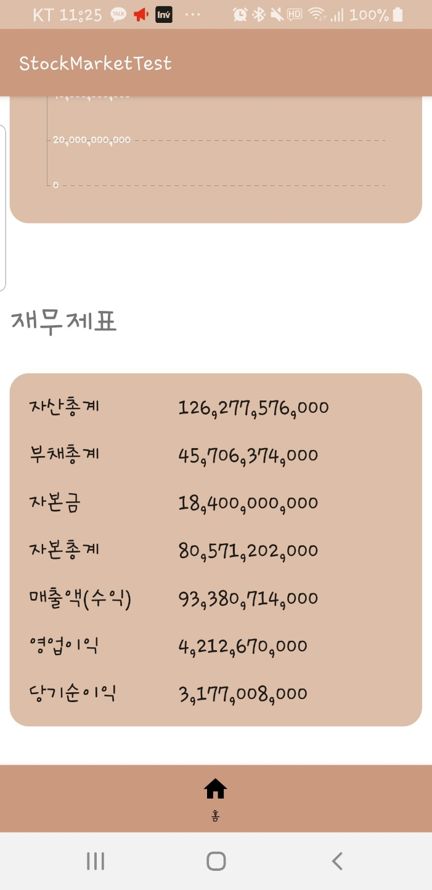

# Burst out your Greed

Hi! This is my side project for scraping data for analyzing stock market

### Purpose of this project
1. Technical
- Minimize use of 3rd party library
- Understanding of coroutines and Moshi Adapter
- Practice of ACC
- Focus on naming(classes, variables, methods, etc)

2. Non-Technical
- Get a daily snapshot of stock market after `closing`
- To identify what people think about stock market on a daily basis

### Tech used
- Basic ACC
- Chart(MPAndroid Chart)

### Things to know

One thing to notice is that `I intentionally removed part of build.gradle file`.

The main reason is that it contains the source(URL) I scrape data from. (though I post screenshots of UI)

### ScreenShots
{: width="100" height="100"} 
{: width="100" height="100"}
{: width="100" height="100"}
{: width="100" height="100"}
{: width="100" height="100"}
{: width="100" height="100"}
{: width="100" height="100"}
{: width="100" height="100"}
{: width="100" height="100"}
{: width="100" height="100"}
{: width="100" height="100"}

### Upcoming plans
- Search functionalities

